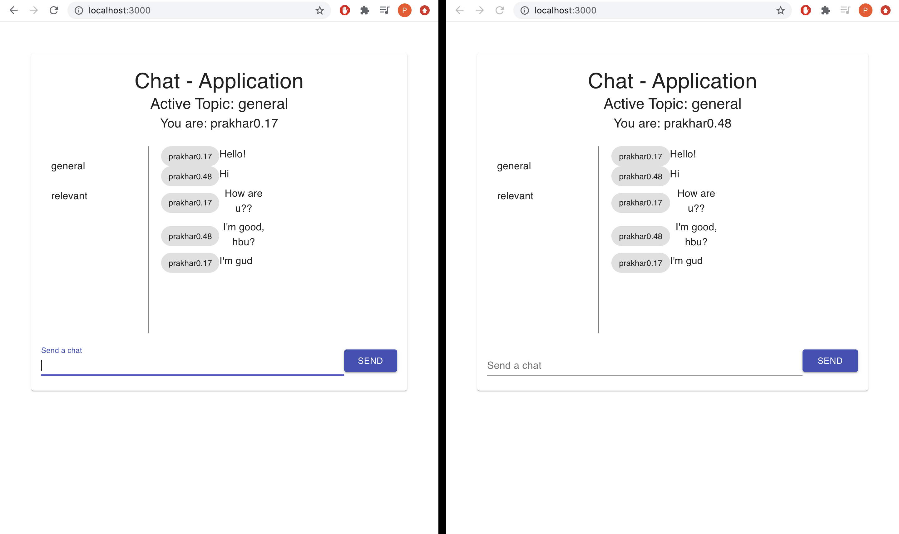

<!-- PROJECT HEADER -->
<br />
<p align="center">

  <h3 align="center">Chat Application</h3>

  <p align="center">
    I created this responsive real-time chatting website using Sockets API for data transmission, with React.js and Redux as the framework.
  </p>
</p>

<!-- TABLE OF CONTENTS -->

## Table of Contents

- [About the Project](#about-the-project)
  - [Built With](#built-with)
- [Installation and Usage](#installation)
- [Contributing](#contributing)
- [License](#license)
- [Contact](#contact)
- [Acknowledgements](#acknowledgements)

<!-- ABOUT THE PROJECT -->

## About The Project

<a href="https://github.com/prakchat1999/Auto-Blog">
    
  </a>

I created this website because:

- I wanted to work with a public API.
- I wanted to use Redux which streamlines the operation of maintaing states in React.js
- I wanted to use React Hooks to further simplify the process.

### Built With

- [Socket.io](https://socket.io/get-started/chat/)
- [React](https://reactjs.org/)
- [CSS](https://www.w3.org/Style/CSS/Overview.en.html)

### Installation and Usage

1. Clone the repo

```sh
git clone https://github.com/prakchat1999/Auto-Blog.git
```

2. Install NPM packages

```sh
npm install
```

3. Run application

```sh
npm start or yarn start
```

<!-- CONTRIBUTING -->

## Contributing

Contributions are what make the open source community such an amazing place to be learn, inspire, and create. Any contributions you make are **greatly appreciated**.

1. Fork the Project
2. Create your Feature Branch (`git checkout -b feature/AmazingFeature`)
3. Commit your Changes (`git commit -m 'Add some AmazingFeature'`)
4. Push to the Branch (`git push origin feature/AmazingFeature`)
5. Open a Pull Request

<!-- LICENSE -->

## License

Distributed under the MIT License. See `LICENSE` for more information.

<!-- CONTACT -->

## Contact

Your Name - pchaturvedi@umass.edu

Project Link: [https://github.com/prakchat1999/Chat-Application](https://github.com/prakchat1999/Chat-Application)

<!-- ACKNOWLEDGEMENTS -->

## Acknowledgements

- [Choose an Open Source License](https://choosealicense.com)
- [GitHub Pages](https://pages.github.com)
- [Material-UI](https://material-ui.com/)
